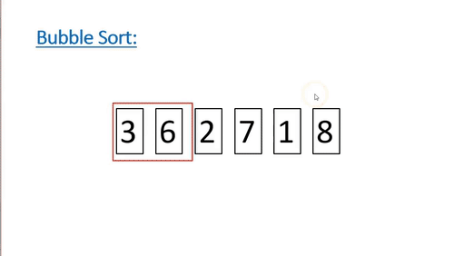

# Lab 8 - Complexity 

> "How do we really know something?" - Your instructor

In today's lab we are going to perform a small experiment to help gather evidence about which of two sorting algorithms are faster. Collecting data is part of the 'really knowing' that something works, but we will then take things a step further by confirming what 'family' of big-o each sorting algorithm belongs to, and confirm that as the input "n" into our function grows asymptotically large, that indeed, one function will be faster than the other. 

There will be a series of exercises in  [exercises](./exercises.md) to help get us thinking about 'proving things' so that we really know what is going on.

# Part 1 - Why Complexity Matters (Experiment)

We have explored this idea of Big-O complexity, but lets put into practice why it really matters with some data.

In this lab you have two files [bubblesort.c](./bubblesort.c) and [csort.c](./csort.c). [csort.c](./csort) is built into the C-Standard library. That means that the C-library already comes with a built-in sorting routine! Both files generate a random array of 10,000 integers and then sort them.

## Experiment

1. Compile the source code with: `clang bubblesort.c -o bubblesort`
    - Run the source code with: `time ./bubblesort`
2. Compile the source code with: `clang csort.c -o csort`
    - Run the source code with: `time ./csort`

Note down your results of the experiment

# Part 2 - Complexity Analysis Q & A.

Discuss and answer the following questions in [exercises](./exercises.md).

# Deliverable

- Answer the questions in Part 2 in [exercises](./exercises.md)

# More resources to help

- [The comparator function in qsort](https://www.geeksforgeeks.org/comparator-function-of-qsort-in-c/)

# (Optional) Going Further Task:

(This is an ungraded task--only work on this if you finish the deliverable). You will have to do a little bit of work to figure out how to open and read from files for this task.

- Our experiment is *slightly* flawed in that we are also computing the time to generate the random numbers. We really just want the elapsed time of the sorting routine.
    - You can do this by computing the elapsed time. See https://www.tutorialspoint.com/how-to-measure-time-taken-by-a-function-in-c as an examplrandom numbers. We really just want the elapsed time of the sorting routine.
        - You can do this by computing the elapsed time. See https://www.tutorialspoint.com/how-to-measure-time-taken-by-a-function-in-c as an example.
